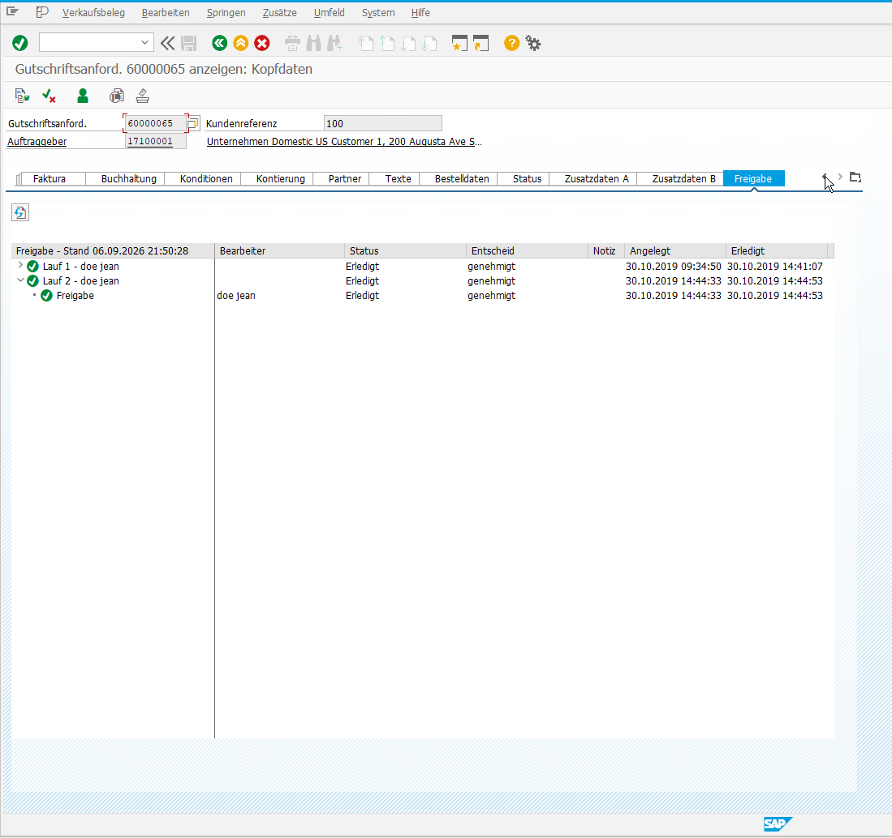
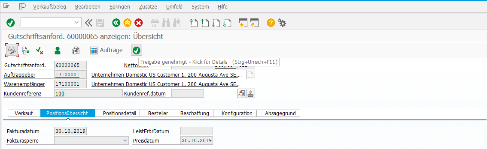

# Flexible-Workflow-Freigabestatus in der SAP GUI (VA03)

English version: [README.md](README.md)

Zeigt den Status des **Flexible Workflow** von SAP S/4HANA für Verkaufsbelege (ausgeliefert für
Gutschriftsanforderungen) direkt in der Transaktion VA03. Anwender, die in der SAP GUI arbeiten,
müssen nicht mehr in die Fiori-App wechseln, um zu sehen, ob ein Beleg genehmigt, abgelehnt oder
noch offen ist.

Die Lösung besteht aus zwei Modulen:

| Modul | Was Sie bekommen | Eingriff in den SAP-Standard? |
|---|---|---|
| **Kern** (Pflicht) | Einen Kopfreiter "Freigabe" in VA03 mit einem Baum aller Workflow-Läufe und ihrer Schritte: Bearbeiter, Status, Entscheid, Zeitstempel und die Notiz (Entscheidungskommentar) jedes Schritts, die sich per Doppelklick öffnet. Dazu einen Report, der dieselben Daten als ALV-Liste zeigt. | Nein. Es werden nur das freigegebene BAdI BADI_SLS_HEAD_SCR_CUS und eigene Objekte verwendet. |
| **Statusbutton** (optional) | Einen Icon-Button in der VA03-Drucktastenleiste (offen, Nachbearbeitung, genehmigt, abgelehnt, abgebrochen) mit Quickinfo wie "Freigabe offen bei Erika Muster". Ein Klick öffnet den Reiter. | Ja. Zwei implizite Erweiterungen in SAPMV45A und eine Kopie eines Standard-GUI-Status. Unternehmen, die den Standard unangetastet lassen wollen, überspringen dieses Modul; der Reiter ist dann über den Belegkopf erreichbar. |

Es gibt keine eigenen Tabellen. Alles wird zur Laufzeit aus dem SAP Business Workflow gelesen.

## Screenshots

Kopfreiter "Freigabe" mit den Workflow-Läufen und Schritten (Kernmodul):

Statusbutton in der VA03-Drucktastenleiste, hier mit dem Icon für "genehmigt" und seiner Quickinfo (optionales Modul):

## Voraussetzungen

- SAP S/4HANA (on-premise oder private cloud) mit aktiviertem Flexible Workflow für
  Gutschriftsanforderungen: SAP-Standard-Workflow-Szenario WS02000029 mit seinen Dialogaufgaben
  TS02000054 und TS02000055 (Workflow-Objekttyp CL_SD_CMR_WORKFLOW).
  Entwickelt und getestet auf S/4HANA 2023 (S4CORE 108, SAP_BASIS 758).
- SAP GUI für Windows / Java (der Reiter verwendet ein SALV-Tree-Control)
- ABAP 7.54 oder höher (Inline-Deklarationen, Konstruktorausdrücke, ABAP Doc)
- abapGit ist bequem, aber nicht nötig: [docs/INSTALLATION.de.md](docs/INSTALLATION.de.md)
  beschreibt beide Wege.

## Komponenten

| Objekt | Typ | Modul | Aufgabe |
|---|---|---|---|
| ZCL_SD_APM_WF_SCOPE | Klasse | Kern | Legt fest, für welche Transaktion und Belegarten die Integration aktiv ist |
| ZCL_SD_APM_WF_READER | Klasse | Kern | Liest Läufe und Schritte des Workflows zu einem Beleg (einzige Datenquelle) |
| ZCL_SD_APM_HEAD_TAB | Klasse | Kern | BAdI-Implementierung zu BADI_SLS_HEAD_SCR_CUS: registriert den Kopfreiter |
| ZSD_APM_INFO | Funktionsgruppe | Kern | Subscreen 0100 (SALV-Tree), Funktionsbausteine; GUI-Status ZU für den optionalen Button |
| ZSD_APM | Nachrichtenklasse | Kern | Alle UI-Texte auf Deutsch, englische Übersetzungstabelle für SE63 in docs/MESSAGES.md |
| ZSD_APM_WF_DISPLAY | Report | Kern | Zeigt den Workflow eines Belegs als ALV-Liste, für Prüfung und Support |
| ZSD_APM_WF_FCODE | Erweiterung | Statusbutton | Source-Code-Plug-in in SAPMV45A: Klick auf den Button navigiert zum Reiter |
| ZSD_APM_WF_GUI_STATUS | Erweiterung | Statusbutton | Source-Code-Plug-in in SAPMV45A: setzt GUI-Status ZU mit dem Button |

Wie die Teile zusammenspielen: [docs/ARCHITECTURE.de.md](docs/ARCHITECTURE.de.md).
Installationsschritte: [docs/INSTALLATION.de.md](docs/INSTALLATION.de.md).

## Installation in Kürze

1. Per abapGit pullen: Alle Objekte inklusive Subscreen, GUI-Status, BAdI-Implementierung und
   der zwei Plug-ins werden angelegt (wer den Statusbutton nicht möchte, entfernt im Pull-Dialog
   den Haken bei den Plug-ins). Ohne abapGit die Objekte manuell aus den Dateien in `/src/`
   anlegen; beide Wege stehen Schritt für Schritt in INSTALLATION.de.md.
2. Application-Log-Objekt ZSD_APM / WF_DISPLAY in SLG0 anlegen und die Workflow-Konstanten
   prüfen (Teil B3, B4).
3. Report ZSD_APM_WF_DISPLAY für eine Gutschriftsanforderung ausführen, dann den Beleg in VA03 öffnen.

## Erweiterung auf weitere Belegarten

Die Belegarten stehen an einer Stelle, `ZCL_SD_APM_WF_SCOPE=>GET_DOC_CATEGORIES`. Weitere
Belegarten aus dem Interface IF_SD_DOC_CATEGORY (zum Beispiel Kundenaufträge) ergänzen oder die
Konstantenliste durch eine Customizing-Tabelle ersetzen. Der Reader braucht dann den
Workflow-Objekttyp und die Task-IDs dieser Belegart (Konstanten `GC_TYPEID` und `GC_TASK` in
`ZCL_SD_APM_WF_READER`).

## Mitmachen

Pull Requests sind willkommen, bitte vorher [CONTRIBUTING.md](CONTRIBUTING.md) lesen. Das
Repository wird bei jedem Push mit [abaplint](https://abaplint.org) geprüft. Code, Kommentare und
Objektnamen sind auf Englisch, damit die internationale SAP-Community mitarbeiten kann; die
Oberflächentexte sind übersetzt.

## Pflege und Kontakt

Entwickelt und gepflegt von der [M2 Digital GmbH](https://www.m2-digital.ch), Tägerwilen, Schweiz.
Fehler und Wünsche bitte als GitHub-Issue melden, Pull Requests sind willkommen. Für Fragen, die
über das Repository hinausgehen, etwa weitere Belegarten oder ein Fiori-Gegenstück:
[info@m2-digital.ch](mailto:info@m2-digital.ch).

## Lizenz

MIT, siehe [LICENSE](LICENSE). Copyright (c) 2026 M2 Digital GmbH. Kostenlose Nutzung, Änderung und
Weitergabe, auch kommerziell; Lizenztext und Copyright-Hinweis müssen erhalten bleiben.
