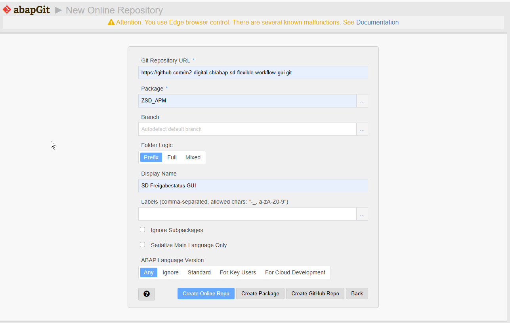
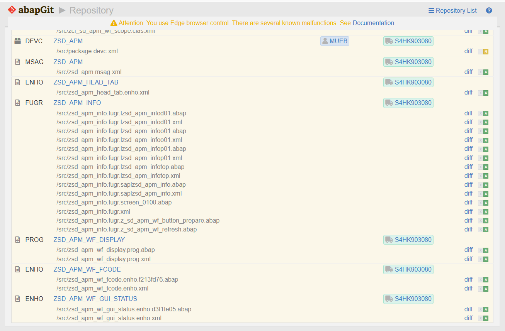
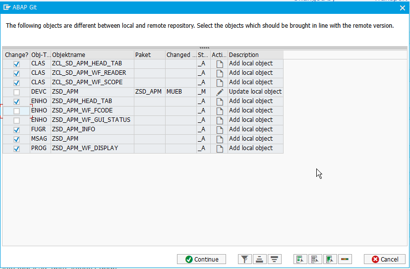
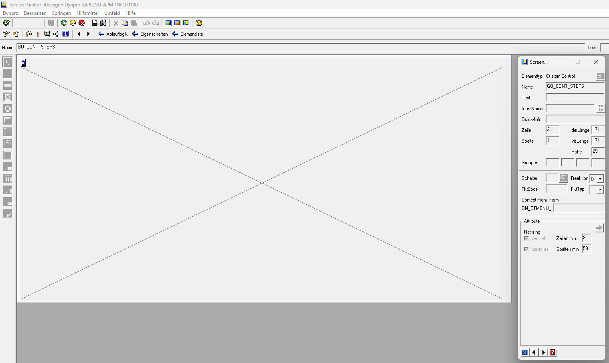
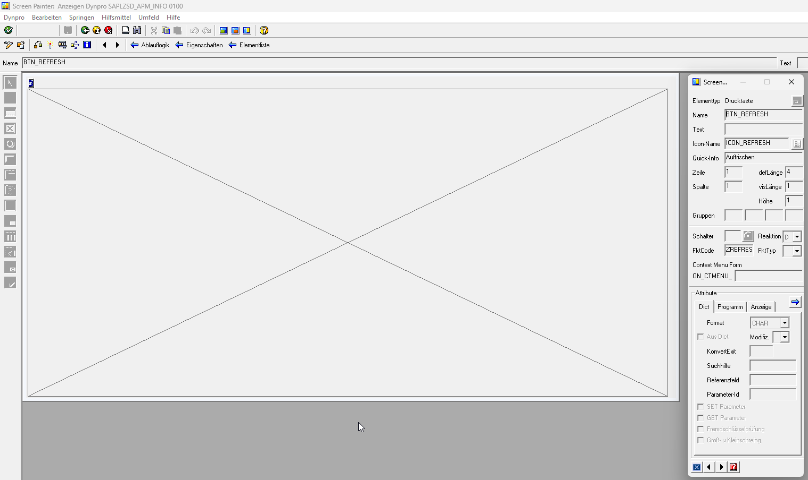
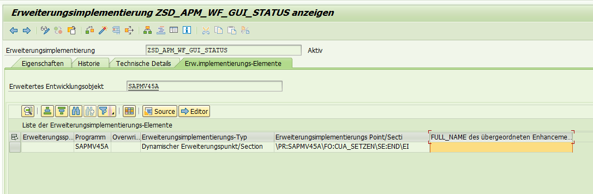

# Installation

Deutsche Version: [INSTALLATION.de.md](INSTALLATION.de.md)

Tested on SAP S/4HANA 2023 (S4CORE 108, SAP_BASIS 758).

## Modules

| Module | What it delivers | SAP standard touched? |
|---|---|---|
| **Core** (mandatory) | Header tab "Approval" in VA03 with the workflow tree, note popup, check report | No. Only the released BAdI BADI_SLS_HEAD_SCR_CUS and own objects. |
| **Status button** (optional) | Icon button in the VA03 toolbar with the approval status, click opens the tab | Yes. Two implicit enhancements in SAPMV45A and a copy of a standard GUI status. |

Without the status button users open the tab through the header detail of the document
(VA03 → Goto → Header → tab "Approval").

Object list

| Object | Type | Module | Delivered as |
|---|---|---|---|
| ZSD_APM | Package | core | abapGit / manual |
| ZSD_APM | Message class | core | abapGit / manual (MESSAGES.md) |
| ZCL_SD_APM_WF_SCOPE | Class | core | source |
| ZCL_SD_APM_WF_READER | Class | core | source |
| ZCL_SD_APM_HEAD_TAB | Class | core | source |
| ZSD_APM_INFO | Function group with includes, 2 function modules | core | source |
| ZSD_APM_INFO screen 0100 | Subscreen | core | abapGit / manual (part B1) |
| ZSD_APM_HEAD_TAB | BAdI implementation | core | abapGit / manual (part B2) |
| ZSD_APM / WF_DISPLAY | Application log object | core | manual (part B3) |
| ZSD_APM_WF_DISPLAY | Report | core | source |
| ZSD_APM_INFO status ZU | GUI status | status button | abapGit / manual (part C1) |
| ZSD_APM_WF_FCODE, ZSD_APM_WF_GUI_STATUS | Enhancement implementations | status button | abapGit / manual (part C2) |

With abapGit everything except the application log object is created automatically. The manual
steps in parts B1, B2, C1 and C2 are only needed when installing without abapGit.

## Part A: Get the sources into your system

### A1. With abapGit (recommended)

**What abapGit is.** abapGit is the free, open-source Git client for ABAP, maintained by the
abapGit community under the MIT license. It is not part of the SAP standard and not a product of
M2 Digital. Website and download: [abapgit.org](https://abapgit.org), source and releases:
[github.com/abapGit/abapGit](https://github.com/abapGit/abapGit), documentation:
[docs.abapgit.org](https://docs.abapgit.org). The steps below are a short reminder only; the
abapGit documentation is the authority, because installation details can change without our
influence.

**If abapGit is not yet in your system.** The quickest way is the standalone version: download
the file `zabapgit_standalone.prog.abap` from the abapGit website, create a report of that name
in SE38 (type executable program, local object `$TMP` is fine), paste the content and activate.
For online repositories the SAP system also needs the SSL certificates of github.com in STRUST;
the abapGit documentation describes this under "Installation".

**How to start it.** SE38 → `ZABAPGIT_STANDALONE` → Execute. If your basis team created a
transaction for it, it is usually called `ZABAPGIT`. If you cannot reach GitHub from the SAP
system, use an offline repository instead: download this repository as ZIP from GitHub and
import it via abapGit → New Offline.

**Log on in German.** The main language of this repository is German; the English texts are
listed in [MESSAGES.md](MESSAGES.md) for transaction SE63. abapGit refuses to pull when the
logon language differs from the main language
("Current login language 'EN' does not match main language 'DE'"), so log on to the SAP system
in German for the installation.

**Decide before you pull: with or without the status button.** The repository contains both
modules. abapGit creates everything it finds unless you deselect objects in the pull dialog.
The pull dialog lists every object with a check box in the column "Change?". To install the
core module only, **remove the check marks of the two objects of type ENHO named
`ZSD_APM_WF_FCODE` and `ZSD_APM_WF_GUI_STATUS`** before you confirm. Everything else stays
selected; GUI status ZU inside the function group is harmless without the plug-ins. If you
pulled the plug-ins by mistake, deactivate or delete the two enhancement implementations in
SE19 and pull again with the check marks removed.

**Pull this repository.**

1. Start abapGit and choose **New Online** (button in the toolbar of the repository list).
2. Fill the dialog "New Online Repository" (field names as of abapGit 1.13x):
   - **Git Repository URL**: `https://github.com/m2-digital-ch/abap-sd-flexible-workflow-gui.git`
   - **Package**: `ZSD_APM`. The package does not have to exist yet. Two options:
     - *Let abapGit create it*: click the button **Create Package** at the bottom of the dialog.
       A popup opens. Enter package `ZSD_APM`, a description such as
       "Flexible-Workflow-Freigabestatus in der SAP GUI (VA03)", software component `HOME` and
       the transport layer of your development system (ask your basis team if unsure; for a
       first test a local package `$ZSD_APM` without transport layer is also possible, but
       local objects cannot be transported later). Confirm; abapGit creates the package and
       fills the field.
     - *Create it yourself*: SE80 → Repository Browser → Package → enter `ZSD_APM` → Create,
       same values as above. Then enter `ZSD_APM` in the abapGit dialog (the `...` button
       next to the field offers a search help).
   - **Branch**: leave empty ("Autodetect default branch").
   - **Folder Logic**: `Prefix` (default, matches `.abapgit.xml`).
   - **Display Name**: optional, for example "SD Freigabestatus GUI".
   - **Labels**, the check boxes and **ABAP Language Version** (`Any`): leave as they are.
   - Confirm with **Create Online Repo**. abapGit now shows the repository with all objects
     marked as new (status "A").

   

   

3. Click **Pull**. abapGit lists the objects it is going to create with a check box each.
   **Without status button: uncheck the two ENHO objects now** (see above). Confirm. If the
   package is transportable, abapGit asks for a transport request: create a new workbench
   request or select an existing one. Then abapGit creates and activates the objects.

   
4. Check in SE80 that package `ZSD_APM` contains the three classes, the message class, the
   function group with subscreen 0100, GUI status ZU, includes and function modules, the
   report and the enhancement implementations. Continue with part B3 (application log object)
   and B4; parts B1, B2, C1 and C2 are already done.

### A2. Without abapGit (manual)

All sources are plain text files in `/src/`. Create the objects in this order, because each
step uses the previous ones. The object texts quoted below are the German originals of the
delivered objects (main language German); log on in German so that the texts land in the main
language.

1. **Package** `ZSD_APM` (SE80 → Package → Create). Description: "Flexible-Workflow-Freigabestatus
   in der SAP GUI (VA03)". Transport layer of your choice.

2. **Message class** `ZSD_APM` (SE91 → Create, logged on in German). Short text:
   "Freigabe-Workflow-Status in der SAP GUI". Enter every message of [MESSAGES.md](MESSAGES.md)
   with its number and the German text. English texts: SE63 or log on in English and enter them
   as translation.

3. **Classes** (ADT recommended, or SE24 → Source Code-Based). Create each class as a global,
   public, final class, then replace the complete source with the content of the file. Activate
   in this order:
   1. `zcl_sd_apm_wf_scope.clas.abap` → ZCL_SD_APM_WF_SCOPE
   2. `zcl_sd_apm_wf_reader.clas.abap` → ZCL_SD_APM_WF_READER
   3. `zcl_sd_apm_head_tab.clas.abap` → ZCL_SD_APM_HEAD_TAB

   In SE24 make sure "Source Code-Based" mode is switched on (button in the toolbar); the class
   headers already contain the ABAP Doc comments (`"!`).

4. **Function group** `ZSD_APM_INFO` (SE80 → Function Group → Create). Short text:
   "Freigabe-Workflow-Status in der SAP GUI".
   1. Open include `LZSD_APM_INFOTOP` and replace its content with
      `zsd_apm_info.fugr.lzsd_apm_infotop.abap`.
   2. Create the includes `LZSD_APM_INFOD01`, `LZSD_APM_INFOP01` and `LZSD_APM_INFOO01`
      (right-click on the function group → Create → Include) and paste the corresponding files.
      D01 is included from the TOP include; add P01 and O01 to the main program
      `SAPLZSD_APM_INFO` below `INCLUDE lzsd_apm_infouxx.` as in
      `zsd_apm_info.fugr.saplzsd_apm_info.abap`.
   3. Create function module `Z_SD_APM_WF_REFRESH` (short text "Freigabe-Reiter: Neuaufbau im
      naechsten PBO vormerken"): no parameters, processing type "Normal". Paste the body from
      `zsd_apm_info.fugr.z_sd_apm_wf_refresh.abap` (between FUNCTION and ENDFUNCTION).
   4. Create function module `Z_SD_APM_WF_BUTTON_PREPARE` (short text "Freigabestatus-Button:
      dynamischen Text vorbereiten"): import parameter `IV_VBELN` type `VBELN_VA`, pass by
      value. Paste the body from
      `zsd_apm_info.fugr.z_sd_apm_wf_button_prepare.abap`.
   5. Activate the whole function group (the subscreen of part B1 can be created before or
      after activation).

5. **Report** `ZSD_APM_WF_DISPLAY` (SE38 → Create, type Executable program). Paste
   `zsd_apm_wf_display.prog.abap`. Title: "Freigabe-Workflow eines Verkaufsbelegs anzeigen".
   Selection text for `P_VBELN`: "Verkaufsbeleg". Activate.

## Part B: Core module

B1 and B2 are only needed after a manual installation (part A2); abapGit delivers both.

### B1. Subscreen 0100 of function group ZSD_APM_INFO

Screen Painter (SE51), program SAPLZSD_APM_INFO, screen 0100.

Screen attributes

| Attribute | Value |
|---|---|
| Short description | Subscreen Kopfreiter Freigabe (Status + Schritte) |
| Screen type | Subscreen |
| Next screen | 0 |
| Rows / columns (occupied) | 30 / 171 |
| Rows / columns (maintenance) | 30 / 172 |
| Settings | none |

Element list

| Element | Type | Attributes |
|---|---|---|
| BTN_REFRESH | Push button | row 1, column 1, defined length 4, visible length 1, height 1, icon ICON_REFRESH (`@42@`), quick info "Auffrischen", function code ZREFRESH, function type blank |
| GO_CONT_STEPS | Custom control | row 2, column 1, length 171, height 29, resizing vertical and horizontal, minimum 8 rows / 59 columns |





Flow logic

```abap
PROCESS BEFORE OUTPUT.
  MODULE pbo_0100.

PROCESS AFTER INPUT.
```

There is no PAI module: the function code ZREFRESH is consumed by the BAdI implementation
(`TRANSFER_DATA_FROM_SUBSCREEN`).

### B2. BAdI implementation ZSD_APM_HEAD_TAB

1. SE19, enhancement spot BADI_SD_SALES_BASIC, BAdI definition BADI_SLS_HEAD_SCR_CUS.
2. Create enhancement implementation `ZSD_APM_HEAD_TAB`, BAdI implementation `ZSD_APM_HEAD_TAB`,
   implementing class `ZCL_SD_APM_HEAD_TAB` (existing class from part A).
3. No filter values. Activate.

### B3. Application log object (recommended)

Technical errors of the reader are written to the application log. Create in transaction SLG0:

| Object | Subobject | Text |
|---|---|---|
| ZSD_APM | WF_DISPLAY | Approval workflow display in SAP GUI |

Without the object the reader silently skips the logging; the display is not affected.

### B4. Check the workflow constants

`ZCL_SD_APM_WF_READER` is delivered for the SAP standard workflow scenario **WS02000029**
(flexible workflow for credit memo requests). SAP ships this scenario with exactly two dialog
tasks, which are the ones evaluated here:

| Constant | Value | Meaning |
|---|---|---|
| GC_TYPEID | CL_SD_CMR_WORKFLOW | Workflow object type linked to the document (SWW_WI2OBJ) |
| GC_TASK-APPROVE | TS02000054 | Dialog task "approve credit memo request" |
| GC_TASK-REWORK | TS02000055 | Dialog task "rework credit memo request" |

Verify the task ids in your system before go-live: transaction SWDD, scenario WS02000029, or
the workflow log (SWI1) of an existing credit memo request workflow.

### B5. Test the core module

1. Run report `ZSD_APM_WF_DISPLAY` for a credit memo request that has a workflow. The list
   shows the runs and steps. If it stays empty, check B4.
2. Open the same document in VA03 → Goto → Header. The tab "Approval" shows the tree.
3. Take a decision in the Fiori app "My Inbox", press the refresh button on the tab.
4. Double-click a step with a note icon: the decision comment opens in a popup.

## Part C: Optional module "status button"

Skip this part if enhancements of SAPMV45A are not wanted in your system. C1 and C2 are only
needed after a manual installation (part A2); abapGit delivers both.

The delivered status ZU is a copy of status U of SAPMV45B from S/4HANA 2023. On another release
the standard status may contain other functions; in that case copy your own status U as
described in C1 and add function ZWF again, so that the toolbar matches your release.

### C1. GUI status ZU of function group ZSD_APM_INFO

1. Menu Painter (SE41): copy status `U` of program **SAPMV45B** to program SAPLZSD_APM_INFO as
   status `ZU`. The status must stay a copy so that all standard functions of VA03 keep working;
   `EXCLUDING cua_exclude` in the plug-in removes the functions SAPMV45A excludes itself.
2. Add function `ZWF` on function key Ctrl+Shift+F11 and place it in the application toolbar.
3. Function ZWF: function text type "Dynamic text", field name `GS_WF_BUTTON` (structure
   SMP_DYNTXT in the TOP include of the function group).

### C2. Source code plug-ins in SAPMV45A

Both are implicit enhancements (SE38 → SAPMV45A → Enhance → Edit → Enhancement Operations →
Show Implicit Enhancement Options). Sources: `src/zsd_apm_wf_fcode.enho.*.abap` and
`src/zsd_apm_wf_gui_status.enho.*.abap` (paste the statements between ENHANCEMENT and
ENDENHANCEMENT).

| Implementation | Location |
|---|---|
| ZSD_APM_WF_FCODE | Include MV45AF0F_FCODE_BEARBEITEN, FORM `fcode_bearbeiten`, implicit option at the beginning of the FORM |
| ZSD_APM_WF_GUI_STATUS | Include MV45AF0C_CUA_SETZEN, FORM `cua_setzen`, implicit option at the **end** of the FORM (`\PR:SAPMV45A\FO:CUA_SETZEN\SE:END\EI`) |



### C3. Test the status button

**First call after activation takes longer.** Activating the two plug-ins invalidates the
generated load of SAPMV45A. The first call of VA01, VA02 or VA03 afterwards shows a progress
popup "Compiling SAPMV45A in separate task" and can take a minute or more, because the program
with its several hundred includes is regenerated. This happens once per system and client and
again after the transport is imported into the next system. To spare the first user, open VA03
once yourself after the import, or regenerate SAPMV45A with transaction SGEN.

1. Open a credit memo request in VA03. The toolbar shows the button "Approval" with the status icon.
2. Hover: the quick info names the current approver.
3. Click: the tab "Approval" opens.

If the click ends with the message "Function ZWF is not available here", the plug-in
ZSD_APM_WF_FCODE is not active (check SE19) or the approval tab is not the first custom header
tab in your system. The button addresses the tab by its position among the custom tabs of
BADI_SLS_HEAD_SCR_CUS; the default is 1 (constant `GC_TAB_POSITION` in ZCL_SD_APM_WF_SCOPE).
If other BAdI implementations register tabs before this one, set the constant to the real
position.

## Translation

All texts are messages of class ZSD_APM. Translate them with transaction SE63 (Short Texts →
Messages). The German texts are listed in [MESSAGES.md](MESSAGES.md).
